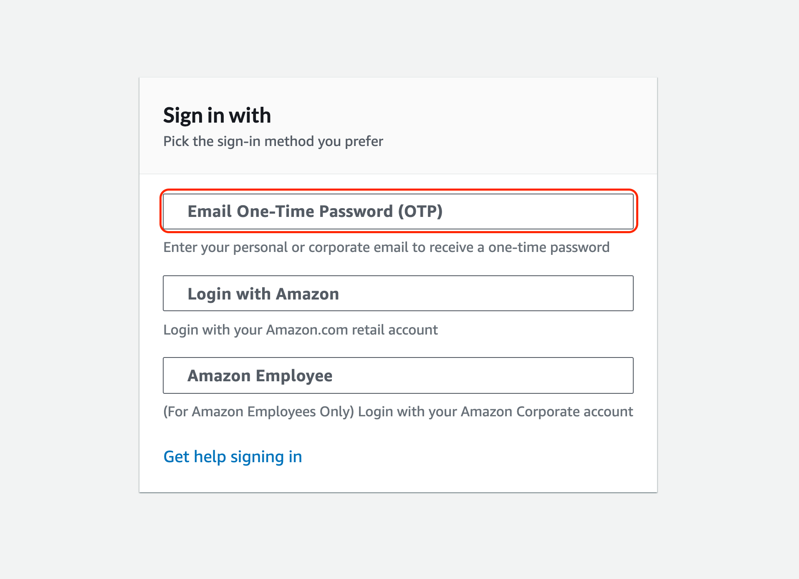

# Hands on Lab 준비

* [https://dashboard.eventengine.run/login](https://dashboard.eventengine.run/login) 사이트에 접속합니다.

.png>)

* 제공받은 개인의 해쉬코드(ex 849adca195e0)를 입력합니다.
* 본인 해시코드는 Support SA분을 통해 제공받습니다.

.png>)

* Email One-Time Password(OTP) 클릭후 이메일을 넣으시면 Passcode(6-digit)를 메일로 제공드립니다.&#x20;

* AWS console 을 클릭합니다.

 (1).png>)

* Open AWS Consoles 를 클릭합니다.

.png>)

* 축하합니다!!. 실습용 핸즈온 사이트 구성이 완성되었습니다. 서비스 리전은 우측상단에서 확인하실수 있습니다.


본 실습 사이트는 최소 12시간이 유효하도록 설정되었습니다. 자세한 안내는 SA분을 통해 제공 받습니다.


* 서울리전을 선택하고 시작합니다.

.png>)
