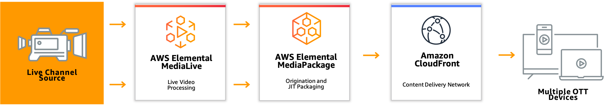
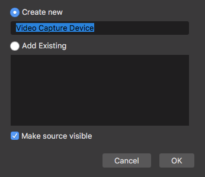

# AWS 미디어서비스를 통한 라이브 워크플로 구성 및 CloudFront로 배포하기

이 실습에서는 **AWS Elemental MediaLive**와 **MediaPackage**를 사용하여 라이브 스트리밍 채널을 **Amazon CloudFront** 통한 배포생성하는 것을 진행합니다. 그리고, 추가적으로 OBS를 이용하여 통해 라이브 채널을 최종 단계서 VLC 플레이어로 확인해봅니다.


 **AWS Elemental MediaLive**는 브로드캐스트 및 스트리밍 전송을 위한 라이브 출력을 생성할 수 있는 실시간 비디오 서비스로, 실시간 비디오 콘텐츠의 형식 및 패키지를 다른 형식 및 패키지로 변환할 수 있습니다.

 **AWS Elemental MediaPackage**는 AWS 클라우드에서 실행되는 JIT\(Just-In-Time\) 비디오 패키징 및 제작 서비스로, MediaPackage를 사용하면 매우 안전하고 확장 가능하며 신뢰할 수 있는 비디오 스트림을 다양한 재생 디바이스 및 CDN\(콘텐츠 전송 네트워크\)에 전달할 수 있습니다.

**Amazon CloudFront**는 MediaPackage 사용자 지정 엔드포인트를 오리진으로 사용하도록 구성되어 있으며 요청 인증을 위해 CDN 식별자 사용자 지정 HTTP 헤더를 포함합니다. CloudFront 배포판은 짧은 지연 시간과 빠른 전송 속도로 시청자에게 라이브 스트림을 전달합니다.

**AWS Amplify**의 개발 도구 및 기능 외에도, AWS Amplify는 AWS 콘솔에서 직접 액세스할 수 있는 완전관리형 정적 웹 호스팅 서비스를 제공합니다. AWS Amplify의 정적 웹 호스팅 서비스는 단일 페이지 웹 앱 또는 서버리스 백엔드가 포함된 정적 사이트를 빌드, 배포 및 호스팅하기 위한 완벽한 워크플로를 제공합니다.

## \*\*\*\*

### **1. AWS Elemental MediaPackage Channel 생성**


노트북에서 전송하는 라이브 스트림을 방송하기 위해, 별도의 MediaPackage 채널을 생성하겠습니다.

1. MediaPackage 서비스 콘솔 페이지로 이동합니다.
2. 우측 상단 ‘Create’를 클릭합니다.


1. **ID**에 ‘builders-live-channel’를 넣고,
2. Input type이 Apple HLS로 되어있는 것을 확인합니다.
3. **Create a CloudFront distrubtion for this channel** 을 선택합니다.
4. **Create** 버튼을 클릭합니다.


* **Add endpoints** 버튼을 클릭합니다.


* **ID**에 ‘builders-live-hlsendpoint’를 입력한 후 **Save** 버튼을 클릭합니다.


* MediaPackage 채널의 생성이 완료 되었습니다. MediaLive 채널을 생성하는 다음 섹션으로 이동합니다.

###  2. AWS MediaLive Channel 생성 


1. **AWS Elemental MediaLive Channel 생성하기**
   1. MediaLive 서비스 콘솔 페이지로 이동합니다.
   2. **Create channel** 버튼을 클릭합니다.


* MediaLive channel에 ingest point 역할을 할 Input을 생성합니다. 채널 메뉴에서 **Input attachments &gt; Add** 버튼을 클릭합니다. 
  1. **Attach input** 에서 **Create input**버튼을 클릭합니다.


* **Inputs**를 선택하고**Create input**을 클릭합니다. **Input name** 입력박스에 ‘live-camera’ 입력하고, RTMP\(push\)를 **Input type**으로 선택합니다.


* **Input security group** 섹션에서**Create** 옵션을 선택하고 CIDR block 텍스트 필드에 ‘0.0.0.0/0’을 입력한 후, **Create input security group**을 클릭하여 security group을 생성합니다.


* **Input destinations**로 이동합니다.  Destination A의 application name으로 ‘builders’를 입력하고 ‘a’를 instance name으로 입력합니다. Destination B의 application name으로 ‘builders’를 입력하고 ‘b’를 instance name으로 입력합니다.


표준 채널의 경우 STANDARD\_INPUT을 선택해야 합니다. 단일 파이프라인 채널의 경우 SINGLE\_INPUT 또는 STANDARD\_INPUT을 선택할 수 있습니다.



* **Create\(생성\)**를 클릭하여 **Input\(입력\)**을 생성합니다.
* Input이 생성된 후, Input 드롭다운 메뉴를 누른 후 ‘live-camera’ 을 선택한 후에 **Confirm \(확인\)** 버튼을 누릅니다. 여기서 아래 나오는 Input destinations 정보를 기록해 둡니다. 이는 추후 OBS 스트리밍 설정 시 사용하게 됩니다.


* **Channel and input details**을 클릭하여 나머지 MediaLive channel 설정을 수행합니다.
* **Channel name**에 ‘builders-live’을 입력합니다. 



**알고계신가요?** 입력대상 주소를 A와B 이중화가 아닌 단일 파이프라인으로 설정하고 싶을 경우, Channel class를 SINGLE\_PIPELINE으로 선택합니다.


* 아래 IAM role 란에는 앞서 만든 MediaLiveAccessRole이 보일 겁니다. Channel template 드롭다운 박스에서 ‘HTTP live streaming\(MediaPackage\)’을 선택합니다. 팝업 창이 나오면 Confirm을 눌러 넘어갑니다.


1. **왼쪽 메뉴** 바의 **Output groups\(출력 그룹\)** 섹션에서 **MediaPackage group**을 선택합니다.
2. MediaPackage Destination 칸에서 MediaPackage channel ID 란에 앞서 생성한 MediaPackage의 ID\(builders-live-channel\)를 입력합니다. 아래 MediaPackage settings의 name에도 같은 값을 입력해 줍니다.


* 아래 MediaPackage outputs에서 Output 10: WebVTT란 오른쪽의 X 버튼을 클릭하여 해당 Output을 삭제합니다.


1. **Create channel\(채널 생성\)**을 클릭하여 채널을 생성합니다.
2. **Start** 버튼을 클릭하고 잠시 기다리면 채널이 시작됩니다.


### **3. OBS Live streaming 생성**



* [https://obsproject.com](https://obsproject.com/) 에서 OBS Studio를 다운로드한 후 실행합니다.


* OBS의 Sources에서 +를 클릭한 후 Video Capture Device를 선택하면 팝업 설정창이 열립니다.


* 팝업 설정창에서 이름을 입력하신 후 OK를 클릭하면 방금 생성한 입력에 대한 Property를 설정하는 화면이 나옵니다.



* Property 설정창에서 Device로 노트북의 카메라를 선택하신 후 OK 버튼을 클릭합니다.


* OBS studio 메인화면의 우측 하단의 Settings를 클릭하여 스트리밍 설정을 진행합니다.


* Service값은 Custom으로 선택하고, Server 값으로 앞서 MediaLive Input생성 시 생성되었던 두개의 Endpoint 의 URL 중 Application Name 까지의 URL을 입력하고 Stream Key 값으로는 Instance Name에 입력한 값을 입력합니다. 예를 들어 endpoint의 URL 값이 rtmp://xx.xx.xx.xx:1935/builders/a인 경우 rtmp://xx.xx.xx.xx:1935/builders/를 Server 값으로 입력하고, a를 Stream Key 값으로 입력한 후 OK를 눌러 설정을 완료합니다.


* MediaLive 채널이 Running 상태이고 MediaPackage와 연결된 상태에서 Start Streaming 버튼을 클릭하여 스트리밍을 시작합니다. \(스트리밍이 정상적으로 시작되면 OBS 우측 하단에 정사작형의 녹색 표시가 나타답니다.\)


\*\*\*\*

### **4. MedaiPackage 의 Endpoint 에서 동영상 재생 확인 및 CloudFront URL 확인**


1. 스트리밍이 시작되면 MediaPackage의 Endpoints에서 Play를 눌러 영상을 확인할 수 있습니다.


   2. PlayBack preview 에서 미리 보기확인과 QR code로 미리보기 할 수 있습니다.


    3. [VLC player를 다운로드](https://www.videolan.org/vlc/) 설치 후 네트워크주소에 CloudFront URL을 입력합니다.


또는 링크를 클릭하여 Safari 브라우저에서 스트림을 재생하거나JW Player 스트림 테스터를 이용하여 재생합니다.

* [https://www.jwplayer.com/developers/stream-tester/](https://www.jwplayer.com/developers/stream-tester/)


   4. CloudFront 를 통해 배포되는 라이브 영상 확인이 완료되었습니다.

### 5. Host web app을 Amplify 통해 배포하기 

최신 웹 앱을 호스팅하는 경우 웹 서버가 필요하지 않으며, 콘텐츠 전송 네트워크를 사용하여 정적 콘텐츠\(HTML, CSS 및 JavaScript 파일\)를 저장합니다. AWS Amplify는 [Amazon CloudFront 글로벌 엣지 네트워크](https://aws.amazon.com/ko/cloudfront/features/)를 사용하여 웹 앱을 전 세계에 배포합니다. 

1. HTML 파일로 저장

* &lt;CloudFront URL&gt;을 입력한 후,  index.html로 저장합니다.
* 영상 재생을 웹브라우저를 통해 확인한 후, ZIP 파일로 압축합니다.\(예, index.zip\)   

```markup
<!DOCTYPE html>
<html>
<head>
<meta charset=utf-8 />
<title>Builders Workshop</title>
  

  <link href="https://unpkg.com/video.js/dist/video-js.css" rel="stylesheet">
  <script src="https://unpkg.com/video.js/dist/video.js"></script>
  <script src="https://unpkg.com/videojs-contrib-hls/dist/videojs-contrib-hls.js"></script>
   
</head>
<body>
  <video id="my_video_1" class="video-js vjs-fluid vjs-default-skin" controls preload="auto"
  data-setup='{}'>
    <source src="<CloudFront URL>" type="application/x-mpegURL">
  </video>
  
<script>
var player = videojs('my_video_1');
player.play();
</script>
  
</body>
</html>
```

    2. Amplify 서비스로 이동한 후 New app, Host web app 을 클릭합니다.

* Deploy without Git Provider 을 선택하고, Continue 클릭합니다.


Amplify 는 정적 웹 호스팅시 GitHub, BitBucket, GitLab 및 AWS CodeCommit의 프라이빗 및 퍼블릭 리포지토리에 연결할 수 있습니다. 여기서는 Git Provider 없이 정적웹 호스팅을 이용해봅니다.



3. App Name과 Environment name에 적당한 이름으로 작성합니다.

* **Drag and drop** 을 클릭하고 zip파일을 업로드 한 후,  **Save and deploy**를 합니다.


4. Amplify를 통해 배포된 도메인을 통해 라이브 영상을 최종합니다.


5. 영상재생 버튼 클릭후 우측하단의 **Picture-in-picture\(PiP\)** 기능으로 영상재생을 확인합니다.  


### **완료**

축하합니다! AWS Elemental MediaLive Service를 이용한 HoL을 완료하셨습니다.

AWS Amplify 정적 웹 호스팅에서는 빌드/배포 및 웹 호스팅이라는 2가지 기능에 대한 요금을 책정합니다. 빌드 및 배포 기능의 경우 빌드 분당 요금은 0.01 USD입니다. 호스팅 기능의 경우, 제공된 GB당 요금은 0.15 USD이고 저장된 GB당 요금은 0.023 USD입니다. AWS 프리 티어를 사용하는 고객은 무료로 시작할 수 있습니다.

