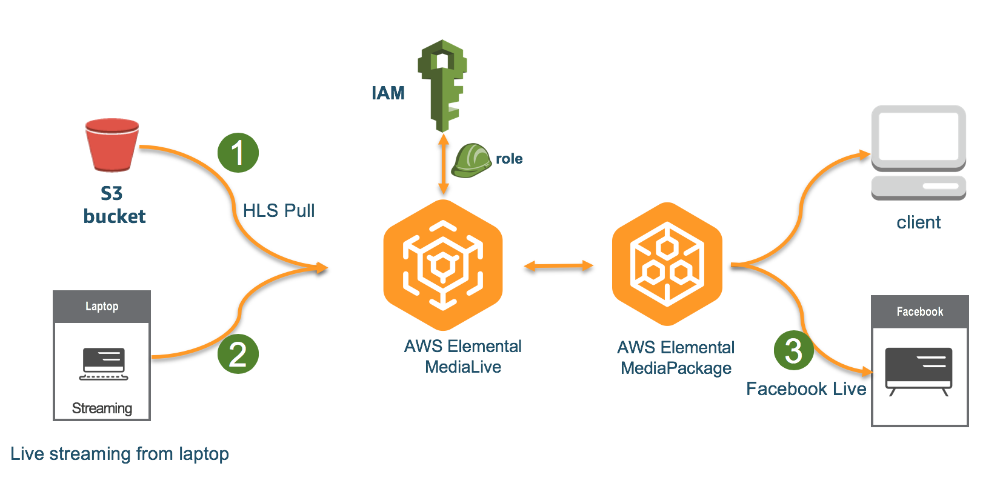
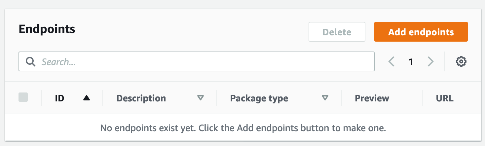
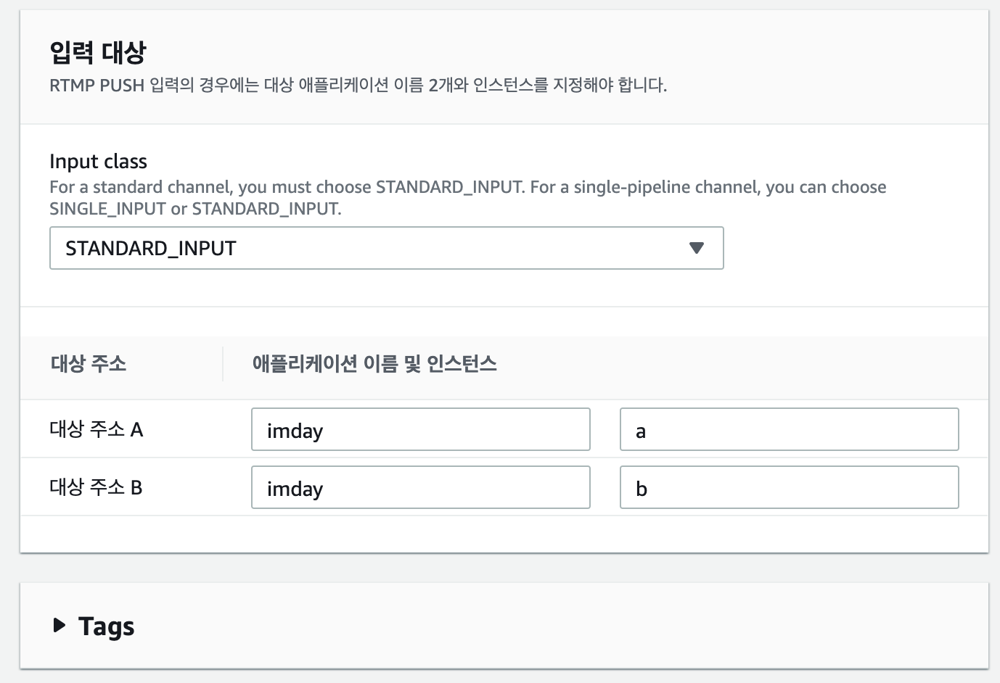
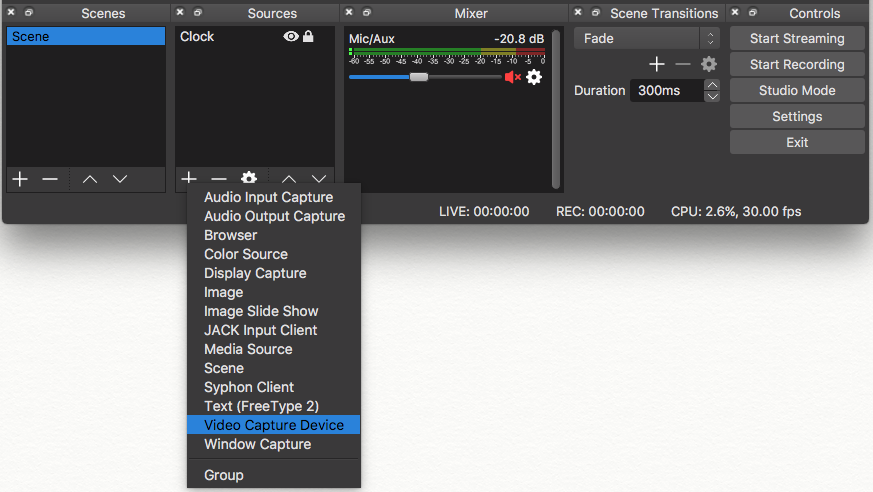
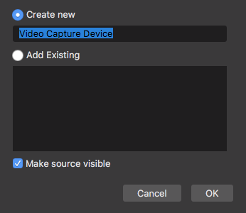
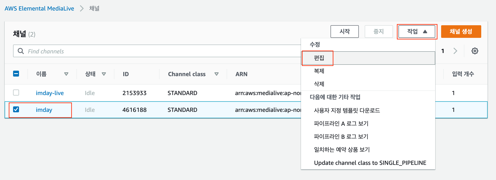
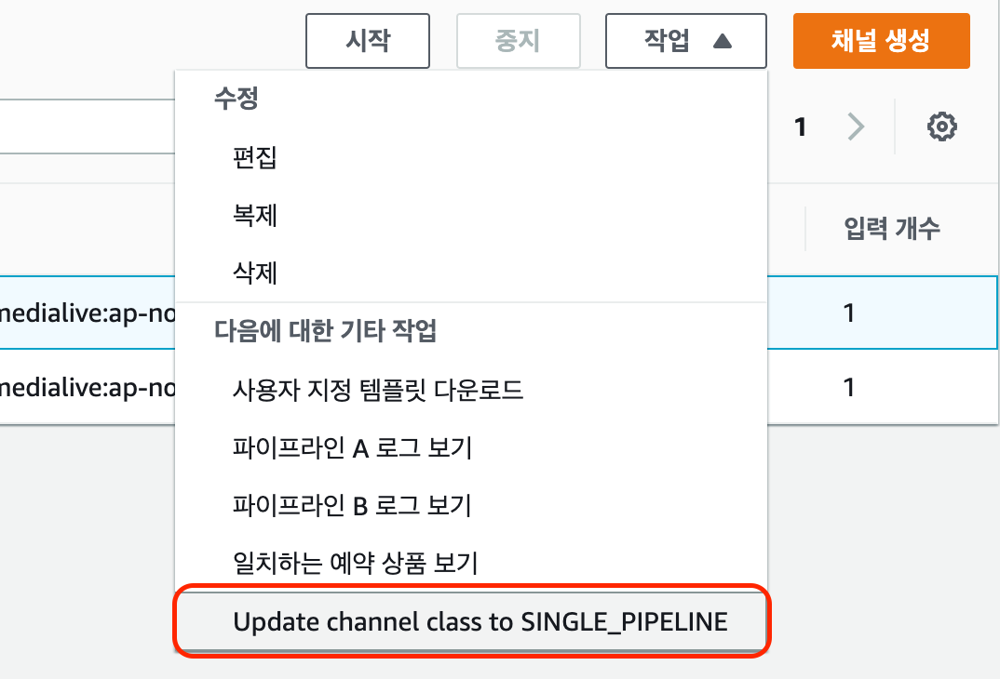
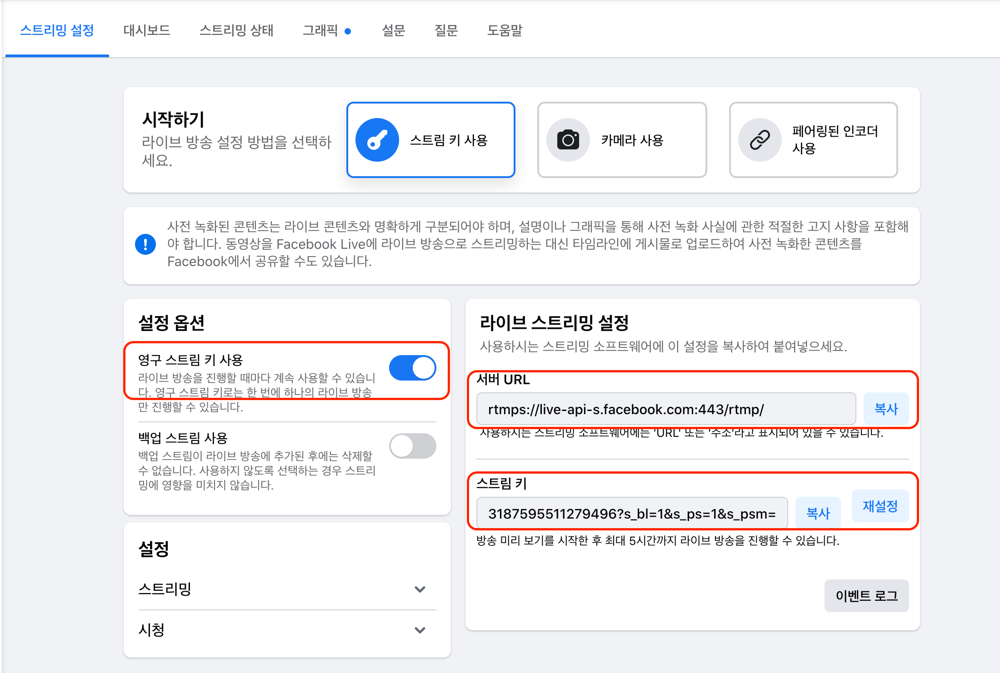
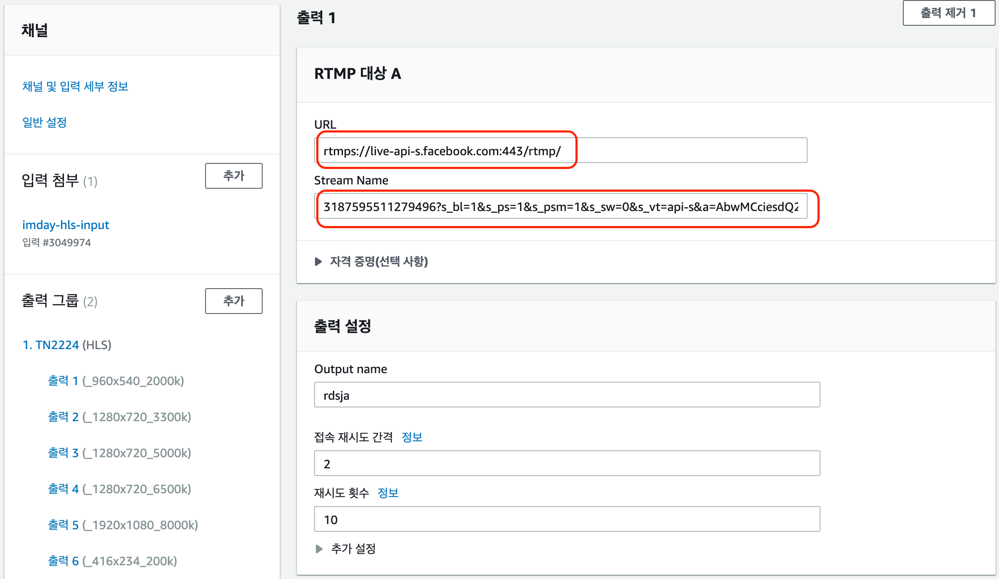

# Live Streaming with AWS Elemental MediaServices

 이 실습에서는 **AWS Elemental MediaLive**와 **MediaPackage**를 사용하여 라이브 스트리밍 채널을 생성하는 것을 진행합니다. 그리고, 추가적으로 OBS를 이용하여 Facebook계정으로 라이브 채널을 구성하는 실습도 진행할 것입니다.



 **AWS Elemental MediaLive**는 브로드캐스트 및 스트리밍 전송을 위한 라이브 출력을 생성할 수 있는 실시간 비디오 서비스로, 실시간 비디오 콘텐츠의 형식 및 패키지를 다른 형식 및 패키지로 변환할 수 있습니다.

 **AWS Elemental MediaPackage**는 AWS 클라우드에서 실행되는 JIT\(Just-In-Time\) 비디오 패키징 및 제작 서비스로, MediaPackage를 사용하면 매우 안전하고 확장 가능하며 신뢰할 수 있는 비디오 스트림을 다양한 재생 디바이스 및 CDN\(콘텐츠 전송 네트워크\)에 전달할 수 있습니다.

## **1. S3소스를 사용한 라이브 스트리밍**

### AWS Elemental MediaPackage Channel 생성 

1. 이 실습에서는 MediaPackage를 Media Origin으로 사용합니다. 먼저, 미디어 패키지 채널을 준비합니다.
2. AWS 콘솔에 로그인 한 후 리전을 선택하고, MediaPackage 서비스 콘솔 페이지로 이동합니다.
3. ‘Create a new channel’을 클릭합니다.


1. **ID**에 ‘imday-mp-channel’를 넣고
2. Input type이Apple HLS로 되어있는 것을 확인 후 **Create**버튼을 클릭5합니다.


* MediaPackage 채널이 성공적으로 생성되면 MediaLive 채널 생성 시 필요한 정보\(두 개 Input에 대한 URL, Username, Password\)를 기록해 놓습니다.


* **Add endpoints** 버튼을 클릭합니다.




**Add endpoint** 채널의 단일 전송 지점을 정의합니다. 엔드포인트는 AWS Elemental MediaPackage가 플레이어나 CDN\(콘텐츠 배포 네트워크, 예: Amazon CloudFront\)과 통합하는 데 필요한 모든 정보를 포함합니다. 사용 가능한 스트림 형식 중 하나로 콘텐츠를 출력하도록 엔드포인트를 구성할 수 있습니다.


* Apple HLS – 콘텐츠를 Apple HLS\(HTTP Live Streaming\)로 패키징합니다.
* Microsoft Smooth – Microsoft Smooth Streaming 플레이어에 맞게 콘텐츠를 패키징합니다.
* CMAF – Apple HLS fragmented MP4\(fMP4\)를 지원하는 디바이스에 맞게 콘텐츠를 패키징합니다.
* DASH-ISO – DASH-ISO ABR 스트리밍 프로토콜에 맞게 콘텐츠를 패키징합니다.

또한 DRM\(디지털 권한 관리\) 및 스트림 비트레이트 프레젠테이션 순서 등에 대한 정보가 엔드포인트에 포함됩니다.

* **ID**에 ‘imday-mp-hlsendpoint’를 입력한 후 **Save** 버튼을 클릭합니다.


* MediaPackage 채널의 생성이 완료 되었습니다. MediaLive 채널을 생성하는 다음 섹션으로 이동합니다.

### **AWS Elemental MediaLive Channel 생성**

MediaLive 채널을 생성하려면, **Input\(입력\)**과 **IAM Role**을 생성하고, **HLS Output Group\(출력그룹\)**을 설정해야 합니다. 그리고 **Input\(입력\)**을 **MediaLive 채널과 연결**해야 합니다.

1. AWS 콘솔에 로그인 한 후 리전을 선택하고, MediaLive 서비스 콘솔 페이지로 이동합니다.

선택한 region에서 MediaLive channel을 생성한 적이 있다면, 아래와 같은 채널 리스트를 보실 수 있습니다.


1. **Create channel** 버튼을 클릭합니다.
2. 첫번째로, MediaLive channel에 ingest point 역할을 할 Input을 생성합니다. 채널 메뉴에서 **Input attachments &gt; Add** 버튼을 클릭합니다. 
3. **Attach input** 에서 **Create input**버튼을 클릭합니다.


1. ‘imday-hls-input’ 을 **Input name**에 입력합니다.
2. **Input Type** 으로 HLS를 선택합니다.
3. **Input Source A** 섹션에서 **Input Source A**의 스트림 URL에 다음을 입력합니다. 위 URL은 이 실습을 위해 미리 생성해 놓은 소스 콘텐트 입니다.

```text
https://s3.amazonaws.com/mediaimmersion/medialive/vod/vanlife.m3u8
```

* **Input Source B**의 URL에도 동일한 URL을 입력합니다. 이 실습에서는 추가 input에 동일한 Input Stream을 사용합니다.

 AWS Elemental MediaLive에서 채널이 표준 채널로 설정된 경우 MediaLive는 업스트림 시스템이 두 개의 소스를 제공할 것으로 예상하므로 두 소스 위치에서 모두 가져오려고 시도하며, 채널이 단일 파이프라인 채널로 설정된 경우 MediaLive는 업스트림 시스템이 하나의 소스를 제공할 것으로 예상하므로 하나의 소스 위치에서 가져오려고 시도합니다.


* **Channel\(채널\)메뉴 &gt; Create\(생성\)** 버튼을 클릭합니다.
* **Input\(입력\)**이 생성된 후, Input 드롭다운 메뉴를 누른 후 ‘imday-hls-input’ 을 선택한 후에 Confirm \(확인\) 버튼을 누릅니다. \(이 과정에서, 방금 생성한 input source를 향후 생성할 MediaLive 채널과 연결합니다.\)


* “imday-hls-input” 세팅 페이지에서, General input settings 하위의 “**일반 입력 설정**”를 “LOOP”로 변경합니다. 이제 Input 설정을 마쳤습니다. 


**정보!** HLS VOD를 연속적인 라이브 소스를 제공하는 라이브 채널로 사용하기 위해 소스 파일을 “LOOP”로 설정합니다.



* **채널 및 입력 세부 정보**를 클릭하여 나머지 MediaLive channel 설정을 수행합니다.


* Channel name에 ‘imday’을 입력합니다. MediaLiveAccessRole이 없는 경우 **Create role from template**\(**템플릿에서 역할 생성**\) 옵션을 선택하고, Create IAM role 버튼을 클릭하여 채널에 Access할 수 있는 권한을 가진 IAM Role을 생성해줍니다. 그런 이후에 Use existing role에 MediaLiveAccessRole이 보이면 Remember role 체크박스를 체크하여 향후에 사용할 수 있도록 저장합니다. 만약 MediaLiveAccessRole이 이미 있는 경우에는 Use existing role 드롭다운 박스에서 MediaLiveAccessRole을 선택합니다. 


* **Channel template\(채널 템플릿\)** 드롭다운 박스에서 ‘HTTP live streaming\(HLS\)’을 선택합니다.


* 왼쪽 메뉴 바의 **출력 그룹** 섹션에서 **TN2224\(HLS\)** 을 선택합니다.



* 첫번째 MediaPackage의 URL을 URL에 입력하고**Credentials** 옵션을 확장합니다. MediaPackage의 첫번째 입력의 사용자명\(username\*\*\*\)을 복사하여**Username**에 붙입니다. 그리고 **Create parameter**를 선택한 후 **Name**에 또 붙입니다. MediaPackage의 첫번째 입력의 password\*\*\*를 복사한 후**Password value**에 붙입니다.


MediaPackage input URL과 Credentials 정보는 위를 참고하시기 바랍니다.



* **파라미티 생성**을 클릭하여 **HLS group destination A** 의 보안 크레덴셜을 생성합니다.





* MediaPackage의 두번째 Input URL을 이용하여 위의 단계와 동일하게 **HLS group destination B**의 설정을 수행합니다.
* MediaPackage input URL과 Credentials은 단계 위를 참고하시기 바랍니다.



* HLS Outputs에서 Output 10: WebVTT란 오른쪽의 출력제거 클릭하여 캡션Output을 삭제합니다.



MediaPackage 출력에서 'X'를 클릭하여 WebVTT의 '출력 10'을 제거하십시오. Input에 캡션이 없는 경우 채널을 만드는 동안 오류를 방지합니다. 



1. **Create channel**을 클릭하여 MediaLive 채널을 생성합니다.
2. **Start** 버튼을 클릭하여 채널을 시작하면 잠시 후 채널이 시작됩니다.


* MediaPackage로 이동하여 채널을 선택한 후 채널의 Endpoints섹션에서 **Play**를 클릭합니다.


* 이제 라이브 방송이 완료되었습니다.


## 2. 노트북을 활용한 라이브 스트리밍

이 섹션은 OBS Studio가 필요합니다. 이 실습에서는 OBS를 이용하여 노트북의 카메라로부터 라이브 스트림을 전송합니다.

### **AWS Elemental MediaPackage Channel 생성**

노트북에서 전송하는 라이브 스트림을 방송하기 위해, 별도의 MediaPackage 채널을 생성하겠습니다.

1. MediaPackage 서비스 콘솔 페이지로 이동합니다.
2. 우측 상단 ‘Create’를 클릭합니다.


1. **ID**에 ‘imday-live-channel’를 넣고,
2. Input type이Apple HLS로 되어있는 것을 확인 후 **Create**버튼을 클릭합니다.


* **Add endpoints** 버튼을 클릭합니다.


* **ID**에 ‘imday-live-hlsendpoint’를 입력한 후**Save** 버튼을 클릭합니다.


* MediaPackage 채널의 생성이 완료 되었습니다. MediaLive 채널을 생성하는 다음 섹션으로 이동합니다.

###  AWS MediaLive Channel 생

1. **AWS Elemental MediaLive Channel 생성하기**
   1. MediaLive 서비스 콘솔 페이지로 이동합니다.
   2. **Create channel** 버튼을 클릭합니다.


* MediaLive channel에 ingest point 역할을 할 Input을 생성합니다. 채널 메뉴에서 **Input attachments &gt; Add** 버튼을 클릭합니다. 
  1. **Attach input** 에서 **Create input**버튼을 클릭합니다.


* **Inputs**를 선택하고**Create input**을 클릭합니다. **Input name** 입력박스에 ‘live-camera’ 입력하고, RTMP\(push\)를**Input type**으로 선택합니다.


* **Input security group** 섹션에서**Create** 옵션을 선택하고 CIDR block 텍스트 필드에 ‘0.0.0.0/0’을 입력한 후, **Create input security group**을 클릭하여 security group을 생성합니다.


* **Input destinations**로 이동합니다.  Destination A의 application name으로 ‘imday’를 입력하고 ‘a’를instance name으로 입력합니다. Destination B의 application name으로 ‘imday’를 입력하고 ‘b’를instance name으로 입력합니다.



* **Create\(생성\)**를 클릭하여 **Input\(입력\)**을 생성합니다.
* Input이 생성된 후, Input 드롭다운 메뉴를 누른 후 ‘live-camera’ 을 선택한 후에 **Confirm \(확인\)** 버튼을 누릅니다. 여기서 아래 나오는 Input destinations 정보를 기록해 둡니다. 이는 추후 OBS 스트리밍 설정 시 사용하게 됩니다.


* **Channel and input details**을 클릭하여 나머지 MediaLive channel 설정을 수행합니다.


* **Channel name**에 ‘imday-live’을 입력합니다. 
* 아래 IAM role 란에는 앞서 만든 MediaLiveAccessRole이 보일 겁니다. Channel template 드롭다운 박스에서 ‘HTTP live streaming\(MediaPackage\)’을 선택합니다. 팝업 창이 나오면 Confirm을 눌러 넘어갑니다.



**알고계신가요?** 입력대상 주소를 A와B 이중화가 아닌 단일 파이프라인으로 설정하고 싶을 경우, Channel class를 SINGLE\_PIPELINE으로 선택합니다.



1. **왼쪽 메뉴** 바의 **Output groups\(출력 그룹\)** 섹션에서 **MediaPackage group**을 선택합니다.
2. MediaPackage Destination 칸에서 MediaPackage channel ID 란에 앞서 생성한 MediaPackage의 ID\(imday-live-channel\)를 입력합니다. 아래 MediaPackage settings의 name에도 같은 값을 입력해 줍니다.


* 아래 MediaPackage outputs에서 Output 10: WebVTT란 오른쪽의 X 버튼을 클릭하여 해당 Output을 삭제합니다.


1. **Create channel\(채널 생성\)**을 클릭하여 채널을 생성합니다.
2. **Start** 버튼을 클릭하고 잠시 기다리면 채널이 시작됩니다.


### **OBS Live streaming 생성**

* [https://obsproject.com](https://obsproject.com/) 에서 OBS Studio를 다운로드한 후 실행합니다.


* OBS의 Sources에서 +를 클릭한 후 Video Capture Device를 선택하면 팝업 설정창이 열립니다.



* 팝업 설정창에서 이름을 입력하신 후 OK를 클릭하면 방금 생성한 입력에 대한 Property를 설정하는 화면이 나옵니다.



* Property 설정창에서 Device로 노트북의 카메라를 선택하신 후 OK 버튼을 클릭합니다.


* OBS studio 메인화면의 우측 하단의 Settings를 클릭하여 스트리밍 설정을 진행합니다.


* Service값은 Custom으로 선택하고, Server 값으로 앞서 MediaLive Input생성 시 생성되었던 두개의 Endpoint 의 URL 중 Application Name 까지의 URL을 입력하고 Stream Key 값으로는 Instance Name에 입력한 값을 입력합니다. 예를 들어 endpoint의 URL 값이 rtmp://xx.xx.xx.xx:1935/imday/a인 경우 rtmp://xx.xx.xx.xx:1935/imday/를 Server 값으로 입력하고, a를 Stream Key 값으로 입력한 후 OK를 눌러 설정을 완료합니다.


* MediaLive 채널이 Running 상태이고 MediaPackage와 연결된 상태에서 Start Streaming 버튼을 클릭하여 스트리밍을 시작합니다. \(스트리밍이 정상적으로 시작되면 OBS 우측 하단에 정사작형의 녹색 표시가 나타답니다.\)


* 스트리밍이 시작되면 MediaPackage의 Endpoints에서 Play를 눌러 영상을 확인할 수 있습니다.

## **3. Facebook에 라이브 스트리밍** 

다음 섹션은 Facebook계정이 필요합니다. 이번 과정은 Facebook live로 스트림을 전송하는 실습입니다. Facebook live video의 기본 세팅은 본인만 볼 수 있는 것입니다. 그리고 라이브 이벤트가 종료된 후 영상을 삭제할 수 있습니다.

### **Facebook으로 output 생성하기**

1. AWS Console에서 MediaLive service로 이동한 후 Channels를 선택합니다. ‘imday’ channel을 선택한 후 **Stop** 버튼을 클릭합니다.
2. **Actions\(작업\)** 버튼 클릭 후 **Edit\(편집\)**를 선택합니다.



     3. Update channel class to **SINGLE\_PIPELINE** 으로 업데이트 합니다.    




**알고계신가요?** 입력대상 주소를 A와B 이중화가 아닌 단일 파이프라인으로 설정하고 싶을 경우, Channel class를 SINGLE\_PIPELINE으로 선택합니다.


    4. 좌측 navigation pane에서 Output groups\(출력 그룹\) 옆에 있는 **Add\(추가\)** 버튼을 클릭합니다.

    ****5. **RTMP**를 선택하고 **Confirm** 버튼을 클릭합니다.


1. **RTMP settings**에서, **Name** input box에 “facebook” 을 입력합니다.
2. **RTMP 출력** 섹션의 **작업 컬럼에**서 **설정**을 클릭을 하면 RTMP 설정 UI가 나옵니다.
3. 이제 브라우저의 새 탭을 열고 페이스북 계정으로 로그인 합니다. 홈에서 **라이브 방송** 를 클릭합니다.


* **스트림키 사용**을 선택합니다. **영구 스트림 키 사용** 체크박스를 선택하고 **서버 URL** 과 **스트림 키** 값을 복해 놓습니다.



1. MediaLive 브라우저 페이지로 돌아가서, **RTMP destination A**의 URL 입력 텍스트 박스에 Facebook의 **Server URL**을 입력하고, Stream Name input 박스에는 **Persistent Stream Key**를 입력합니다.



   2. Scroll down to **Stream settings** 섹션으로 스크롤 다운 하여, **Video**를 선택하고 1920과 1080을 각각 **Width**와 **Height** 텍트스 박스에 입력합니다. 그리고 **Codec Settings** 드롭다운 박스에서 H264를 선택합니다.

   ****3**. Rate Control**,항목을 확장하여 **Bitrate** 텍스트박스에 “4000000”을 입력합니다.


1. 좌측 Navigation Pane의 **Update channel** 버튼을 클릭합니다.
2. 채널을 선택한 후 **Start** 버튼을 클릭합니다.
3. Facebook 브라우저 탭으로 돌아가면 영상 재생이 시작되는 것을 확인할 수 있습니다. 그리고 우측 하단의 Go Live 버튼은 영상이 준비되면 활성화 됩니다
4. **Go Live** 버튼을 클릭하면 Facebook 계정으로 스트리밍을 시작할 수 있습니다.

**Go Live** 버튼은 Facebook이 실시간 영상을 Facebook 페이지에서 방송할 수 있도록 합니다. Facebook Live user interface는 Facebook으로 라이브 방송이 성공적으로 전달되었다는 Preview영상을 보여줍니다.


### **완료**

축하합니다! AWS Elemental MediaLive를 이용한 HoL을 모두 완료하셨습니다.

