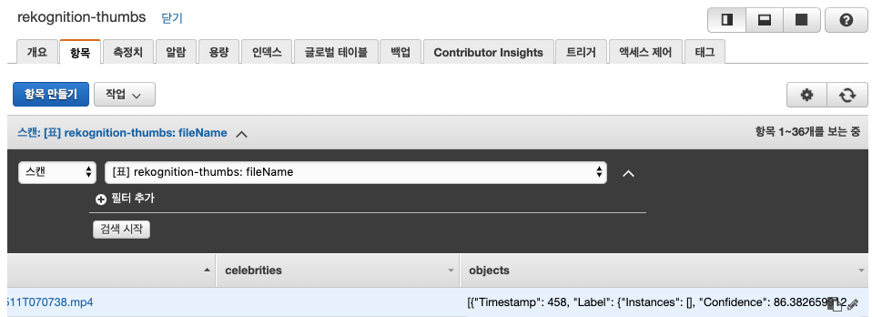

# AWS 머신 러닝 및 미디어 서비스들을 이용하여 비디오 메타데이터 추출하기

이 워크샵을 통해, 우리는 AWS의 도구들과 빌딩 블록들을 이용하여 자동적으로 비디오의 메타데이터\(사람, 사물, 행위, 그리고 영상 속 오디오\)를 생성하는 방법을 살펴볼 예정입니다. 해당 실습은 다음과 같이 세 단계로 이루어져 있습니다.

* 1장: 영상에서 추출한 이미지를 통해 유명 인사 인식하기
* 2장: 영상의 사물 인식하기
* 3장: 영상 내 음성을 받아쓰기

## 1장 – 영상에서 추출한 이미지를 통해 유명 인사 인식하기

이번 모듈에서 우리는 AWS Elemental MediaConvert를 이용하여 영상에서 이미지 파일들을 추출하는 방법을 살펴봅니다. 이후 이 이미지들로 AWS Rekognition의 유명 인사 인식 API를 호출한 후, 결과를 DynamoDB에 저장합니다. 우리가 만들 서비스의 아키텍쳐는 아래 다이어그램과 같습니다.


1. AWS 콘솔에 로그인합니다 \([https://console.aws.amazon.com/console/home](https://console.aws.amazon.com/console/home)\) 
2. AWS 관리 콘솔에서 **서비스**를 클릭하고 **보안, 자격 증명 및 규정 준수** 부분에서 **IAM**을 선택합니다.


* 왼쪽 탐색 바에서 **역할**을 선택하고, **역할 만들기**를 선택합니다. **AWS 서비스**를 선택하고, 이 역할을 사용할 서비스로 **Lambda** 를 선택한 후, **다음:권한** 버튼을 클릭합니다.


* **권한 정책 추가** 창의 **검색 박스**에 아래의 정책들을 검색 후, 체크박스를 클릭하여 정책을 연결합니다.
  1. IAMFullAccess
  2. CloudWatchLogsFullAccess
  3. AmazonRekognitionFullAccess
  4. TranslateReadOnly
  5. AmazonTranscribeFullAccess
  6. AmazonS3ReadOnlyAccess
  7. AmazonDynamoDBFullAccess

위의 정책들에 모두 체크하였다면 “**다음: 태그**”를 클릭하고, 이어 “**다음:검토**”를 클릭합니다.

* “LambdaMediaAILabRole”로 역할 이름을 지정한 후, 해당 역할에 아래와 같이 정책들이 연결되었는지 확인합니다. 만약 아래 리스트의 정책 중 빠진 것이 있다면, “이전” 버튼을 클릭하여 바로 전 단계로 돌아갑니다.


모두 완료되었다면 “역할 생성”을 누릅니다.


IAM 역할은 사용자의 AWS 계정을 대신하여 AWS 서비스에게 AWS 서비스 요청 API를 사용할 권한을 주는 데에 사용됩니다. 사용자 이름이나 패스워드, 또는 API 키들을 관리할 필요 없이, 역할을 이용하여 신뢰할 수 있는 서비스에게 특정 리소스에 대한 권한을 부여할 수 있습니다. 위의 예제에서 우리는 AWS Lambda가 사용할 수 있는 역할을 생성하고, 이 역할에 AWS 계정 내의 특정 서비스\(DynamoDB나 Rekognition\)들을 사용할 수 있는 권한을 연결시켰습니다.


만약 이전에 AWS Elemental MediaConvert를 사용해 보신 적이 없다면, MediaConvert가 S3 버킷에 읽고 쓰기 위한 역할을 생성해야 합니다.

1. MediaConvert 역할을 생성합니다.

   1. **역할 만들기**를 클릭합니다.
   2. 서비스 목록에서 **MediaConvert**를 선택합니다.
   3. **다음: 권한**을 클릭합니다.
   4. **다음: 태그**를 클릭합니다.
   5. **다음: 검토**를 클릭합니다.
   6. 새로 만든 역할에 이름을 정해줍니다. 여기서는 “vod-MediaConvertRole”로 지어 보겠습니다.
   7. **역할 생성**을 누릅니다.

#### Create A S3 Bucket

1. 화면 상단의 **서비스**를 클릭한 후, 저장소 카테고리 아래의 **Amazon S3**를 선택합니다. 
2. **+버킷 만들기**를 클릭합니다. ****
3. 버킷 이름은 유일해야 하므로, 다음과 같은 형태로 이름을 지어 보겠습니다: “**&lt;이름&gt;**-immersionday”. 예를 들어 이름이 John Smith라면, 다음과 같이 지을 수 있겠습니다: “smith-immersionday”. 그리고 드롭 다운 메뉴에서 이 랩을 수행하고 있는 리젼을 선택해 주세요.


Amazon S3 버킷 이름은 글로벌하게 유일해야 합니다. 만약 당신이 고른 버킷 이름이 이미 사용중이라면 다른 문자를 이용하여 유일하도록 만들어 주세요.


오른쪽 아래의 **버킷 만들기**를 누릅니다.

#### Create A DynamoDB Table

1. 화면 상단의 **서비스** 버튼을 누르고 데이터베이스 카테고리의 **DynamoDB**를 선택합니다. 
2. **테이블 만들기**를 클릭합니다. 그리고 테이블 이름을 “rekognition-thumbs”로 입력합니다. 이후 기본 키에 “fileName"을 입력하고, 문자열 타입으로 지정합니다. 다른 모든 값들을 그대로 둔 뒤 **생성**을 누릅니다.


#### Create A Lambda Function

1. 화면 상단의 **서비스** 버튼을 누르고 컴퓨팅 카테고리의 **Lambda**를 선택합니다. 
2. **함수 생성**을 누르고, **새로 작성**을 선택합니다..
   1. 함수에 다음과 같은 형태로 유일한 이름을 지어 줍니다. “**&lt;이름&gt;**-RekognitionThumbnails”.
   2. 런타임은 “Python 2.7”을 선택합니다.
   3. **권한** 란 아래, **실행 역할을 선택하거나 생성하여..** 를 눌러 메뉴를 확장합니다.
   4. **실행 역할**에는 “**기존 역할 사용**”을 선택합니다.
   5. 이전 단계\(스텝 5\)에서 생성한 “LambdaMediaAILabRole”을 선택합니다.
   6. 오른쪽 아래 **함수 생성**을 누릅니다.


1. **함수 코드** 부분에 아래 코드를 복사하여 붙여넣습니다. \(주의: 혹시 띄어쓰기와 들여쓰기가 정상적으로 붙여넣어졌는지 확인해 주세요. 만약 이 문서에서 복사 후 붙여넣기 서식이 깨진다면, 다음 링크에서 Lambda 스크립트를 다운로드 받아 사용하세요.

```python
https://s3.amazonaws.com/mediaimmersion/mediaanalysis/RekognitionThumbnails.py
```

* 또는 아래 **함수 코드**를 참고하세요.

```python
import boto3
rekogClient = boto3.client('rekognition')
dynamoClient = boto3.resource('dynamodb')
table = dynamoClient.Table('rekognition-thumbs')

def lambda_handler(event, context):
	s3_bucket_name = event['Records'][0]['s3']['bucket']['name']
	s3_object_key = event['Records'][0]['s3']['object']['key']
	
	rekogResponseCeleb = rekogClient.recognize_celebrities(Image={
		'S3Object': {
			'Bucket': s3_bucket_name, 
			'Name': s3_object_key}})

	celebs = []
	
	print rekogResponseCeleb
	
	for celeb in rekogResponseCeleb['CelebrityFaces']:
		celebs.append(celeb['Name'])
	
	if len(celebs)>0:
		response = table.put_item(Item={
			'fileName': s3_object_key,
			'celebrities': celebs
		})

	return "Done"
```


**도전 과제:** 파이썬 SDK\(boto3\)을 이용하여 호출할 수 있는 모든 Rekognition 함수들의 리스트는 여기서 확인해 보실 수 있습니다. 위의 코드를 이용하여 다른 Rekognition 함수, 예를 들어 detect\_text\(\)와 같은 함수를 사용하는 방법을 생각해 보세요.


1. Lambda 함수 콘솔의 **Designer** 섹션을 살펴봅니다. 왼쪽 사이드의 **트리거 추가** 를 클릭한 후, **S3**을 트리거로 선택합니다.
   1. **버킷**에서 드롭 다운 메뉴를 눌러 위에서 생성한 버킷을 선택합니다.
   2. **이벤트 유형**에 대해 **모든 객체 생성 이벤트**를 선택합니다.
   3. **접두사** 란에 **thumbs/** 를 입력합니다.
   4. **접미사** 란에 **.jpg**를 입력합니다.
   5. **추가** 버튼을 누릅니다.


1. Lambda **구성**을 클릭합니다. 왼쪽 메뉴 중 **일반 설정** 란이 나옵니다. 편집을 눌러 나온 메뉴에서 **제한 시간**을 **30초**로 설정합니다. **저장**을 누릅니다.


* 페이지의 오른쪽 위의 **저장** 버튼을 누릅니다. 

#### Create a MediaConvert Job to Extract Images

1. 화면 위의 **서비스**를 클릭하고, 미디어 서비스 카테고리의 **MediaConvert**를 클릭합니다.
2. **작업 생성** 또는 **시작하기**를 클릭합니다. 
3. “입력 1” 박스에 다음 링크를 붙여넣습니다.

```python
s3://samisb-external/mediaimmersion/GrandTour_101_Clip_15s.mp4
```

1. 작업 패널의 **출력 그룹**에서 추가를 클릭하고, **파일 그룹**을 고릅니다. 이후 **Select**을 누릅니다.


1. 사용자 지정 그룹 이름에 “**Thumbnails for Rekognition**”를 입력하고, 대상 입력 박스에서 **찾아보기**를 클릭합니다. 이전에 생성한 S3 버킷을 찾아 Choose 버튼을 누르고 Location에 “thumbs/”를 입력합니다.


   3. 출력 섹션에서 "Output1"을 클릭하고  **이름 한정자**에 “$dt$”를 입력하고, **확장자**에 “jpg”를 입력합니다.


  4. 출력 부분에서 “Output 1”을 클릭합니다.

* **컨테이너** 부분에 “컨테이너 없음”를 고릅니다.
* **비디오 코덱** 부분에는 “JPEG로 프레임 쳐”를 선택합니다.
* 프레임 속도 에는 “1/1”을 입력합니다.



**Hint:** MediaConvert를 이용하여 JPEG 이미지를 캡쳐하는 경우, 프레임 속도 값을 통해 영상에서 초당 캡쳐하고자 하는 프레임 수를 결정할 수 있습니다.


예를 들어 프레임 속도 값이 1/10인 경우, 영상에서 10초당 1개의 JPEG 이미지를 캡쳐하게 됩니다. 먄약 프레임 속도 값을 30/1로 정한다면 영상에서 1초당 30개의 프레임을 캡쳐합니다. 위의 예에서는 매 초당 1개의 프레임을 캡쳐하게 됩니다.

1. 인코딩 설정의 왼쪽 부분에서 “Audio 1”을 선택하고 **오디오 제거**를 클릭합니다.


  **** 2. ****왼쪽 부분의 **출력 그룹**에서 **추가**를 클릭합니다. “File group”을 고르고 Select를 누릅니다.


   3. 사용자 지정 그룹 이름에 “**MP4 for Rekognition**”을 입력하고 대상 입력 박스에서 '찾아보기' 를 클릭합니다. 이전에 생성한 S3 버킷을 찾아 Choose 버튼을 누르고 Location에 “mp4/”를 입력합니다.  


   4.  출력 섹션의 이름 한정자에 “$dt$”를 입력하고, 확장자 란에 “mp4”를 입력합니다.


   5. 출력 아래의 “Output 1”을 클릭합니다. **비트레이트\(bits/s\)** 부분에 “6m”을 입력합니다. \(오디오1 제거는 하지 않습니다.\)



**Hint:** MediaConvert에 Bitrate을 입력할 때, 초당 비트 값을 모두 입력해도 되지만, 간단히 메가비트를 m으로, 킬로비트를 k로 표기할 수도 있습니다. 예를 들면 Bitrate 란에 600000, 6m 또는 6000k로 입력하는 경우, 모두 동일하게 6Mbps로 인코딩된 출력 영상이 생성됩니다.


1. 왼쪽 **작업 설정** 란에서 **AWS 통합**을 누릅니다.
   1. **IAM 역할** 부분에 이전에 생성한 vod-MediaConvertRole IAM 역할을 선택합니다.


1. 스크롤을 내려 오렌지색 “**생성**” 버튼을 누릅니다.
2. 트랜스코딩 작업이 끝날 때까지 잠시 기다립니다. 최근 작업 페이지의 **새로 고침**을 눌러 작업 상태가 complete로 변경된 것을 확인하면, **서비스** **데이터베이스** **DynamoDB**를 차례로 눌러 DynamoDB 콘솔로 들어갑니다.
   1. 화면 왼쪽의 **테이블**을 클릭합니다.
   2. 이전에 생성한 “rekognition-thumbs” 테이블을 선택합니다.
   3. **항목** 탭을 누릅니다. 모두 잘 되었다면 유명 인사들이 나온 썸네일 이미지들과 그 이미지에 나온 유명인 이름들이 적힌 목록이 나오는 것을 볼 수 있습니다.


## 2장 – 영상에서 물체 인식하기

이 모듈에서 우리는 AWS Elemental MediaConvert를 이용하여 트랜스코딩한 영상을 AWS Rekognition을 사용하여 물체들을 인식하는 실습을 진행합니다. 인식된 결과 데이터는 DynamoDB에 저장합니다.


**NOTE:** 이 모듈은 이미 이전 1장을 수행했다는 가정 하에 진행되어 몇몇 리소스들은 재활용될 예정입니다.


1. **서비스 보안, 자격 및 규정 준수 IAM**을 선택합니다. 
2. 왼쪽 메뉴에서 **역할**을 선택합니다. 
3. **역할 만들기**를 클릭합니다.
   1. **이 역할을 사용할 서비스 선택**에서 **Rekognition**을 선택합니다.
   2. **다음: 권한**을 클릭합니다.
   3. **다음: 태그**를 클릭합니다.
   4. **다음: 검**를 클릭합니다.
   5. 역할 이름을 “RekognitionRole”로 짓습니다.
   6. **역할 만들기**를 클릭합니다.
   7. 역할의 ARN을 노트해 두고 추후 사용할 수 있게 텍스트 파일 등으로 저장해 둡니다. 
4. **서비스 컴퓨팅 Lambda**를 선택합니다. 
5. **함수 생성**을 클릭합니다.
   1. **함수 이름**: **&lt;이름&gt;**-RekognitionVideo-Results
   2. 런타임: **Python 2.7**
   3. **권한** 탭을 열고,
   4. **역할: 기존 역할 사용**
   5. **기존 역할**: LambdaMediaAILabRole을 입력합니다.
   6. **함수 생성**을 클릭합니다. 
6. 아래 코드를 복사하여 **함수 코드** 란에 붙여넣습니다. 만약 들여쓰기/띄어쓰기가 정상적으로 복사되지 않은 경우, 아래 링크에서 텍스트 버전을 다운로드하여 붙여넣어 주세요.

```python
https://s3.amazonaws.com/mediaimmersion/mediaanalysis/RekognitionVideo-Results.py
```

```python
import boto3,json

client = boto3.client('rekognition')
dynamoClient = boto3.resource('dynamodb')
table = dynamoClient.Table('rekognition-thumbs')

def lambda_handler(event, context):
    message = json.loads(event['Records'][0]['Sns']['Message'])
    print message
    jobId = message['JobId']
    status = message['Status']
    objectName = message['Video']['S3ObjectName']
    bucketName = message['Video']['S3Bucket']
   
    response = client.get_label_detection(JobId=jobId)

    dynamoResponse = table.put_item(Item={
        'fileName': objectName,
        'objects': json.dumps(response['Labels'])
    })    
        
    return 'Done'
```

1. 오른쪽 위의 **Deploy** 버튼을 클릭해 주세요. 
2. **서비스** **애플리케이션** **통합** **Simple** **Notification** **Service**로 들어갑니다. 
3. **주제 생성** 탭에 “AmazonRekognitionVideo-Notification” 으로 주제 이름을 입력하고, **다음 단계**를 누릅니다.
4. **주제 생성** 창에서 **표시 이름**에 **RekVideo**를 입력하고 **주제 생성** 버튼을 누릅니다.
5. 주제 세부 사항 페이지에서 **구독 생성**을 클릭합니다.
   1. 프로토콜: AWS Lambda
   2. 엔드포인트: 위에서 생성한 Lambda 함수의 ARN을 선택합니다. 이 ARN은 Lambda 서비스 메뉴에서 찾을 수 있습니다.


* **구독 생성**을 클릭합니다.


* 주제 세부 사항 페이지에서 주제 ARN을 텍스트 파일에 복사 / 붙여넣기 합니다. 이 ARN은 추후 사용될 예정입니다. 



**알고 있나요?** SNS 주제를 이메일 주소로 구독할 수 있습니다. 위의 SNS 구독에 여러분의 이메일 주소를 추가하면, Rekognition Video가 작업을 완료할 때마다 이메일로 알림을 받을 수 있습니다.


1. 위 SNS 주제의 ARN을 복사해 두는 것을 잊지 마시고, 서비스 컴퓨팅 Lambda를 선택합니다. 
2. **함수 생성**을 누릅니다.
   1. 이름: **&lt;your-last-name&gt;**-RekognitionVideo
   2. 런타임: Python 2.7
   3. 역할: 기존 역할 사용
   4. 기존 역할: LambdaMediaAILabRole 또는 첫 번째 섹션에서 생성한 역할의 이름을 입력합니다.
   5. **함수 생성**을 클릭합니다.
3. 아래 코드를 복사하여 **함수 코드** 란에 붙여넣습니다. 만약 들여쓰기/띄어쓰기가 정상적으로 복사되지 않은 경우, 아래 링크에서 텍스트 버전을 다운로드하여 붙여넣어 주세요.

```python
https://s3.amazonaws.com/mediaimmersion/mediaanalysis/RekognitionVideo.py
```

```python
import boto3
import json

client = boto3.client('rekognition')

def lambda_handler(event, context):
    s3_bucket_name = event['Records'][0]['s3']['bucket']['name']
    s3_object_key = event['Records'][0]['s3']['object']['key']
    
    response = client.start_label_detection(
        Video={
            'S3Object': {
                'Bucket': s3_bucket_name,
                'Name': s3_object_key
            }
            
        },
        NotificationChannel={
            'SNSTopicArn': 'arn:aws:sns:us-east-1:1234567890:AmazonRekognitionVideo-Notification',
            'RoleArn': 'arn:aws:iam::1234567890:role/RekognitionRole'
            
        },
        MinConfidence=85
        )
   
    return 'Done'
```


**알고 있나요?** Rekognition은 위에서 쓰인 MinConfidence 와 같이 몇몇 옵션 파라미터들을 제공합니다. MinConfidence를 지정하여 일정 수준 이상의 신뢰도를 갖는 결과만 Rekognition의 응답으로 받도록 할 수 있습니다.


1. 아래 코드를 수정합니다. “SNSTopicArn” 을 위에서 만든 SNS 주제의 ARN으로 바꿔넣습니다. 또한 “RoleArn”을 이전에 생성한 RekognitionRole IAM 역할의 ARN으로 바꿔넣습니다.

```python
NotificationChannel={
 'SNSTopicArn': 'arn:aws:sns:us-east-1:1234567890: AmazonRekognitionVideo-Notification',
 'RoleArn': 'arn:aws:iam::1234567890:role/RekognitionRole'
 }

```

Lambda 콘솔의 맨 위에서 왼쪽 **트리거 추가** 를 클릭하고, 드롭 다운 메뉴에서 **S3**를 클릭합니다.

1. 아래의 트리거 설정 란에서,
   1. **버킷**: 1장에서 만든 S3 버킷을 선택합니다.
   2. **이벤트 유형**에 대해 **모든 객체 생성 이벤트**를 선택합니다.
   3. **접두사**: **mp4/** 를 입력합니다.
   4. **접미사:** **.mp4**를 입력합니다.
   5. **추가** 버튼을 누릅니다.


1. 오른쪽 위의 **저장** 버튼을 클릭합니다. 
2. **서비스** **미디어 서비스** **MediaConvert**를 선택합니다. 
3. 마지막 단계에서 이미 완료된 작업의 작업 ID를 클릭합니다.
   1. 오른쪽 위에서 **중복**을 누릅니다.
   2. 오른쪽 아래에서 **생성** 버튼을 누릅니다.
4. MediaConvert 작업이 완료되고, Rekognition이 비디오를 분석 완료될 때까지 잠시 기다립니다. 만약 해당 SNS 구독에 이메일 주소를 추가한 경우, MediaConvert 작업이 완료되면 메일을 받게 됩니다. 
5. **서비스 데이터베이스 DynamoDB**를 선택합니다.
6. 왼쪽 메뉴에서 **테이블**을 선택합니다. 
7. **rekognition-thumbs** 테이블을 선택합니다. 
8. **Items** 탭을 선택합니다.
   1. 이전 장에서 유명 인사 인식 후 JPEG 이미지 정보 뿐만 아니라, 새로운 object 열에 mp4 파일 항목이 생긴 것을 볼 수 있습니다. 파일 이름을 클릭하면 전체 내용을 볼 수 있습니다. Object 열에는 비디오를 이용하여 객체를 인식한 결과가 JSON 문자열로 정리되어 있는데, 신뢰도 점수와 타임스탬프\(밀리세컨드 단위\), 그리고 비디오 어디에서 해당 객체가 인식되었는지 나와 있습니다.



축하합니다! 여러분은 이제 비디오를 트랜스코딩하고, 이미지를 추출하고, 영상에 나온 유명 인사와 객체들을 인식하고, 이를 데이터베이스에 저장하는 자동화된 파이프라인을 생성했습니다.

## 3장 – 영상 내 음성을 받아쓰기

이번 모듈에서, 우리는 위의 두 모듈을 통해 만들 워크플로에 Amazon Transcribe를 이용한 자동화된 음성 받아쓰기 서비스를 추가할 예정입니다. 아래 다이어그램은 이번 모듈의 아키텍처를 보여줍니다.


**노트:** 이번 모듈은 위의 두 모듈을 이미 완료했다는 가정 하에 진행됩니다. 위의 모듈에서 생성한 몇몇 리소스들은 재활용될 예정입니다.

1. **서비스 컴퓨팅 Lambda**를 선택합니다.
2. 위에서 생성한 **&lt;이름&gt;-RekognitionVideo** Lambda 함수를 선택합니다.
3. 아래 파이썬 코드를 ‘Done’을 리턴하는 부분 바로 위에 덧붙입니다. 파이썬에서는 띄어쓰기와 들여쓰기가 매우 중요하므로, 정상적으로 붙여넣어지지 않는 경우 아래 URL에서 전체 코드를 다운로드 받아 사용하세요**.**

```python
https://s3.amazonaws.com/mediaimmersion/mediaanalysis/RekognitionVideo-Transcribe.py
```

  
코드를 다운로드하여 사용하시는 경우, **Rekognition 역할** 및 **SNS주제**에 대한 **ARN**을 변경하는 것을 잊지 마세요.

```python
import boto3
import json

client = boto3.client('rekognition')

def lambda_handler(event, context):
    s3_bucket_name = event['Records'][0]['s3']['bucket']['name']
    s3_object_key = event['Records'][0]['s3']['object']['key']
    
    response = client.start_label_detection(
        Video={
            'S3Object': {
                'Bucket': s3_bucket_name,
                'Name': s3_object_key
            }
            
        },
        NotificationChannel={
            'SNSTopicArn': 'arn:aws:sns:us-east-2:1234567890:AmazonRekognitionVideo-Notification',
            'RoleArn': 'arn:aws:iam::1234567890:role/RekognitionRole'
            
        },
        MinConfidence=85
        )
   
    transcribe = boto3.client('transcribe')

    job_uri = "https://s3.us-east-2.amazonaws.com/" + s3_bucket_name + "/" + s3_object_key
       
    transcribe.start_transcription_job(
        TranscriptionJobName="TranscribeJob",
        Media={'MediaFileUri': job_uri},
        MediaFormat='mp4',
        LanguageCode='en-US'
        )
   
    return 'Done'

```


**주의** 

위의 코드에서 job\_uri 부분의 **us-east-2**를 이전 단계에서 S3 버킷을 생성한 지역으로 변경해 줍니다. 도쿄 리전을 사용하고 있으면 **ap-northeast-1**, 서울리전을 사용하고 있으면 **ap-northeast-2** 가 됩니다.


1. 오른쪽 위의 **Deploy** 버튼을 누릅니다. 
2. **서비스 미디어 서비스 MediaConvert**를 선택합니다. 
3. 이전 모듈에서 완료된 작업의 작업 ID를 클릭합니다.
   1. 오른쪽 위의 **중복**을 누릅니다.
   2. 오른쪽 아래의 **생성** 버튼을 누릅니다. 
4. MediaConvert 작업이 끝날 때까지 잠시 기다립니다.
5. 서비스 머신 러닝 Amazon Transcribe를 선택합니다. 
6. TranscribeJob이라는 작업을 선택합니다. 
7. 만약 작업 상태가 Complete로 나온다면, 영상에서의 음성이 받아쓰기된 결과를 받아볼 수 있습니다. 만약 작업이 아직 완료되지 않았다면 잠시 기다린 후에 페이지를 다시 불러와 보세요.



**노트:** 이 모듈에서 우리는 자동적으로 트랜스코딩을 수행하고 영상 내 음성을 텍스트로 변환하는 빠르고 간단한 방법을 확인해 보았습니다. 여기서는 AWS 콘솔을 통해서 완료된 텍스트 변환 작업을 수동으로 확인했습니다만, Amazon CloudWatch Events를 통해 Transcribe 작업을 상태를 모니터링하는 형태로 완전히 자동화할 수도 있습니다. 자세한 내용은 [https://docs.aws.amazon.com/transcribe/latest/dg/cloud-watch-events.html](https://docs.aws.amazon.com/transcribe/latest/dg/cloud-watch-events.html) 에서 확인 가능합니다.


