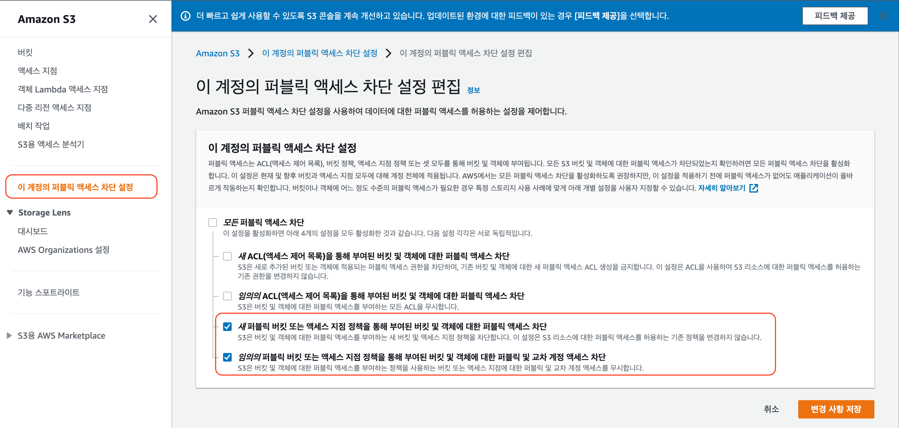

# Video-On-Demand Streaming with AWS Elemental Media Services

본 모듈에서는 원본 비디오를 **Apple HTTP Live Streaming(HLS) Adaptive Bitrate Format(ABR)**으로 트랜스코딩하고, 이를 웹을 통해 서비스하는 AWS Elemental MediaConvert Job을 만들어 봅니다. 기본 Lab 수행에 최대 20분 가량 소요되며, 추가 과제 수행에 최대 15분 가량 소요됩니다.

.png>)

**수행 방법**

이 섹션에서는 콘솔을 이용, S3 버킷을 만들고 여기에 MediaConvert 작업의 결과물을 저장합니다. 테스트 플레이어에서 콘텐츠에 액세스 할 수 있게 하기 위해, Public Read 액세스를 허용하고 CORS (Cross Origin Resource Sharing) 정책을 적용합니다.

## S3 버킷 생성

1. AWS 관리 콘솔에서 **서비스** 를 클릭하고, 스토리지 서비스 **S3** 를 선택합니다.
2. **+버킷 만들기**를 선택합니다.
3. **버킷 이름**에 대해 **vod-<자신의 이름>**과 같이 글로벌하게 유일한 이름을 넣어 주세요. **리전 선택** 주세요. 객체소유권에서 'ACL활성화됨'을 선택하고, '버킷 소유자 선호'로 변경합니다.&#x20;


**4.  '이 버킷의 퍼블릭 엑세스 차단 설정'** 에서 아래와 같이 **'새 ACL을 통해 부여된 버킷 및 캑체에 대한 퍼블릭 차단'** 과 **'임의의 ACL을 통해 부여된 버킷 및 캑체에 대한 퍼블릭 차단'**체크박스를 해제해 줍니다. 이후 아래 경고문의 ‘**현재 설정으로 인해 이 버킷과 그 안에 포함된 객체가 퍼블릭 상태가 될 수 있음을 알고 있습니다.**’&#x20;



**5. S3 메뉴에 '이 계정의 퍼블릭 엑세스 차단 설정'** 에서 아래와 같이 **'새 ACL을 통해 부여된 버킷 및 캑체에 대한 퍼블릭 차단'** 과 **'임의의 ACL을 통해 부여된 버킷 및 캑체에 대한 퍼블릭 차단'**체크박스를 해제해 줍니다. 이후 아래 경고문의 ‘**현재 설정으로 인해 이 버킷과 그 안에 포함된 객체가 퍼블릭 상태가 될 수 있음을 알고 있습니다.**’ 에서도 동일하게 체크박스를 선택해 줍니다.&#x20;


1. 이제 이 S3 버킷에 올리는 데이터들은 인터넷을 통해 접근하는 누구나 접근할 수 있습니다. 체크박스를 선택해 줍니다. 이후 **버킷 만들기** 버튼을 클릭하여 버킷을 생성합니다.
2. S3 콘솔에서 방금 생성한 버킷을 클릭하여 개요 페이지로 들어갑니다.
3. **속성** 탭을 선택하고 **정적 웹 사이트 호스팅** 타일을 클릭합니다.
4. **‘이 버킷을 사용하여 웹 사이트를 호스팅합니다’** 를 선택합니다.
5. 인덱스 문서 란에 index.html 을 넣습니다.\
   _참고: S3는 사용 여부와 상관없이 인덱스 문서 설정을 필요로 합니다._
6. **저장**을 누릅니다.


1. 다음으로, **권한** 탭을 누르고 **CORS 구성**을 클릭합니다. 그리고 아래의 XML 문서를 복사하여 CORS 구성 편집기에 붙여넣고 **저장** 버튼을 누릅니다. 이 설정을 통해 브라우저가 모든 Origin에서 해당 S3 내의 컨텐츠를 요청할 수 있습니다.

* JSON 복사 하여 사용하세요.&#x20;

```javascript
[
    {
        "AllowedHeaders": [
            "*"
        ],
        "AllowedMethods": [
            "GET"
        ],
        "AllowedOrigins": [
            "*"
        ],
        "MaxAgeSeconds": 3000
    }
]
```


## IAM 역할 생성

다음으로 MediaConvert가 S3 버킷에 대한 읽기/쓰기 및 CloudWatch에 상태 이벤트를 기록할 수 있도록 하기 위해, Identity and Access Management (IAM) 역할을 만들어 MediaConvert에게 할당해 주어야 합니다. IAM 역할은 사용자, 서비스 또는 어플리케이션이 서비스에 대해 수행할 수 있는 권한들을 정의합니다.

1. AWS 관리 콘솔에서 **서비스**를 클릭하고 보안, 자격 증명 및 규정 준수 부분에서 **IAM**을 선택합니다
2. 왼쪽 탐색 바에서 **역할**을 선택하고, **역할 만들기**를 선택합니다.
3. **AWS 서비스**를 선택하고, 이 역할을 사용할 서비스로 **MediaConvert** 를 선택한 후, **다음:권한** 버튼을 클릭합니다.


_참고: 역할을 사용할 서비스를 선택하게 되면 AWS 서비스가 사용자 대신 특정한 역할을 맡을 수 있도록 역할에 대한 신뢰 정책이 자동으로 만들어집니다. 만약 CLI 또는 AWS CloudFormation를 이용하여 이 역할을 생성하고 있으신 경우, 직접 신뢰 정책을 구성해 주어야 합니다._

__

1. **다음:태그**를 누릅니다.
2. **다음:검토**를 누릅니다.
3. 역할 이름에 __ vod-MediaConvertRole 을 입력합니다.
4. **역할 만들기**를 누릅니다.
5. 역할 페이지의 필터 박스에 vod-MediaConvertRole 을 입력하고, 방금 생성한 역할을 클릭합니다.
6. 해당 역할의 요약 페이지 위쪽에 나와 있는 **ARN을 적어 둡니다**. 이후 모듈에서 이 ARN을 사용하게 됩니다.



ARN? Amazon 리소스 이름(ARN)은 AWS 리소스를 고유하게 식별합니다.


## MediaConvert 작업 만들기

MediaConvert 작업은 소스 컨텐츠 비디오를 입력받아 다수의 출력들을 가질 수 있는 출력 그룹들로 비디오를 변환할 수 있습니다. 하나의 미디어 변환 작업은 입력된 비디오를 여러 코덱을 적용하고 패키징한 다양한 버전의 비디오를 만들 수 있습니다. 이 모듈에서는 단일 입력 비디오를 가져와 하나의 Apple HLS 출력 그룹으로 변환하는 MediaConvert 작업을 만들어 봅니다. 이를 통해 소스를 다양한 bitrate의 여러 chunk 파일들로 인코딩하는 Adaptive bitrate 스택의 예를 살펴볼 수 있습니다. 텍스트 기반의 manifest 파일들과, 각 인코딩 스트림의 미디어 chunk data 들은 HTTP 서버(S3)를 통해 서비스됩니다.

 (1).png>)

1. 이 Lab을 진행하는 리전에서 MediaConvert 콘솔을 엽니다.
2. 우측 **작업 생성** 칸 안의 **시작하기** 버튼을 누릅니다.
3. 이 Lab을 진행하는 리전에서 MediaConvert 콘솔을 엽니다.
4. 우측 **작업 생성** 칸 안의 **시작하기** 버튼을 누릅니다.


* 입력 1 아래의 박스에 Source Content를 아래와 같이 입력합니다.

```
s3://mediaimmersion/mediaconvert/VANLIFE.m2ts
```

.png>)

1. 작업 패널의 출력 그룹에서 **추가**를 선택합니다.
2. **Apple HLS** 박스를 선택하고 Select를 누릅니다.


&#x20; _3._ Apple HLS 가 선택된 것을 출력 그룹의 작업 패널에서 확인하고, Apple HLS 설정 폼을 확인합니다.

&#x20; 4\. 사용자 지정 그룹 이름에 HLS라고 입력합니다.

&#x20; 5\. 이전 모듈에서 생성한 버킷 이름을 이용하여, 대상 입력 박스에 아래와 같이 입력합니다.

```
s3://vod-<자신의 이름>/assets/VANLIFE/HLS/
```

.png>)

1. 다른 설정들은 모두 기본값으로 둡니다.
2. 아래 출력 패널에서 **출력 추가**를 두 번 눌러 총 3개의 출력을 생성합니다.

여기까지 진행한 화면은 아래와 같습니다.

.png>)

1. 출력 그룹 섹션에서 Output 1을 선택하여 Output 1 에 대한 출력 설정 창으로 들어갑니다.
2. 출력 설정의 Preset에서**System-Avc\_16x9\_360p\_29\_97fps\_1200kbps** 을 선택합니다.
3. **이름 한정자**에\_360을 입력합니다.
4. **세그먼트 한정자**에 $dt$를 입력합니다. 이는 변수로 d는 일자를, t는 시간을 의미합니다. 이를 이용하여 추후 생성되는 세그먼트 파일명에 일자와 시간을 표기하게 됩니다.


1. 출력 그룹 섹션에서**Output 2** 를 선택하여 Output 2에 대한 출력 설정 화면으로 들어갑니다.
2. 출력 설정의 Preset에서 **System-Avc\_16x9\_540p\_29\_97fps\_3500kbps** 를 선택합니다.
3. **이름 한정자**에 \_540 을 입력합니다.
4. **세그먼트 한정자**에 $dt$ 을 입력합니다.



_참고: 이름 한정자와 세그먼트 한정자를 설정하는 이유는, 같은 경로에 출력 파일을 저장하기 때문입니다. 이를 통해 같은 폴더에 저장된 다른 더 긴 비디오의 잔여 부분들을 읽게 되는 상황을 막을 수 있습니다._


1. 출력 그룹 섹션에서 **Output 3** 을 선택하여 Output 3에 대한 출력 설정 화면으로 들어갑니다.
2. 출력 설정의 Preset에서 **System-Avc\_16x9\_720p\_29\_97fps\_5000kbps** 을 선택합니다.
3. **이름 한정자**에 \_720 을 입력합니다.
4. **세그먼트 한정자**에 $dt$ 를 입력합니다.


1. 왼쪽 사이드 바의 작업 설정에서 **AWS통합**을 선택하여 작업 설정 창으로 이동합니다.
2. **IAM 역할 드롭다운** 메뉴에서 이전 섹션에서 생성한 IAM 역할을 선택합니다.


1. 페이지의 맨 아래로 스크롤을 내리고 **생성**을 클릭합니다.
2. 작업이 완료되기를 기다립니다. 최근 작업 페이지에서 새로 고침 버튼을 눌러 현재 작업의 진행 상태를 확인할 수 있습니다.


## 비디오 재생

1. 전 모듈에서 만든 미디어 S3 버킷 vod-<자신의 이름>으로 클릭니다.
2. **assets** 폴더를 선택하고, **작업** 드롭다운 메뉴에서 ACL을 사용하여 '**퍼블릭으로 설정**을 클릭합니다.


1. **/assets/VANLIFE/**HLS 안의 master manifest 파일인 VANILIFE\_540.m3u8의 객체 URL을 확인합니다.


1. 링크를 클릭하여 Safari 브라우저에서 스트림을 재생하거나JW Player 스트림 테스터를 이용하여 재생합니다.

* [https://www.jwplayer.com/developers/stream-tester/](https://www.jwplayer.com/developers/stream-tester/)


## **완료**

축하합니다! AWS Elemental MediaConvert를 이용하여 성공적으로 Adaptive bitrate 스트림을 생성하고 오리진 서버로 S3를 이용하여 Video-on-demand 형태로 스트림을 서비스했습니다. 만약 15분 정도의 여유가 있다면, 아래 추가 과제 세션을 진행해 주세요. 여유가 없으신 경우 아래 부분을 건너뛰고 랩에서 사용된 서비스를 제거하는 부분으로 넘어가시면 되겠습니다.

**추가 실습**

만약 시간이 남아 관련된 내용을 더 살펴보고자 하신다면, 아래와 같은 실습을 진행해 보세요:

* AWS Lambda를 이용하여 프로그래머틱하게 MediaConvert 작업을 생성하기 (아래 실습 매뉴얼이 이어집니다.)
* 직접 웹캠이나 스마트폰으로 비디오를 촬영한 후, 이를 MediaConvert로 처리하기.
* MP4로 트랜스코딩한 추가 출력 그룹을 생성해 보기.
* 여러 입력 영상들을 합쳐 보기.
* CloudWatch의 상태 이벤트를 확인해서 여러분의 이메일 주소로 전달해 보기.

**추가 과제: AWS Lambda를 이용하여 프로그래머틱하게 MediaConvert 작업을 생성하기**

&#x20;방금까지 콘솔을 이용하여 MediaConvert 작업을 만드는 방법을 배웠습니다. 이번에는 AWS Lambda를 사용하여 서버리스 형태로 MediaConvert 작업을 자동화하여 제출하는 예를 살펴보겠습니다.


## IAM Role 만들기

1. AWS 관리 콘솔에서 **서비스**를 클릭하고, 보안, 자격 증명 및 규정 준수 부분에서 **IAM**을 선택합니다.
2. 왼쪽 탐색 바에서 **역할**을 선택하고, **역할 만들기**를 선택합니다.
3. **AWS 서비스**를 선택하고, 이 역할을 사용할 서비스로 **Lambda**를 선택한 후, **다음:권한** 버튼을 클릭합니다.

.jpeg>)_역할을 사용할 서비스를 선택하게 되면 AWS 서비스가 사용자 대신 특정한 역할을 맡을 수 있도록 역할에 대한 신뢰 정책이 자동으로 만들어집니다. 만약 CLI 또는 AWS CloudFormation를 이용하여 이 역할을 생성하고 있으신 경우, 직접 신뢰 정책을 구성해 주어야 합니다._

1. **필터** 옆 검색 텍스트 박스에 AWSLambdaBasicExecutionRole 를 입력하여 해당 역할을 체크합니다.
2. **다음:태그**를 누릅니다.
3. **다음:검토**를 누릅니다.
4. **역할 이름**에 VODLambdaRole을 입력합니다..
5. **역할 만들기**를 누릅니다.
6. 역할 페이지의 필터 박스에 VODLambdaRole을 입력하고, 방금 생성한 역할을 클릭합니다.
7. **권한** 탭에서 오른쪽의 **인라인 정책 추가**를 누른 후, **JSON** 탭을 선택합니다.

.png>)

* 아래 JSON 문서를 정책 문서 박스에 붙여넣습니다.

```
{
    "Version": "2012-10-17",
    "Statement": [
        {
            "Action": [
                "logs:CreateLogGroup",
                "logs:CreateLogStream",
                "logs:PutLogEvents"
            ],
            "Resource": "*",
            "Effect": "Allow",
            "Sid": "Logging"
        },
        {
            "Action": [
                "iam:PassRole"
            ],
            "Resource": [
                "<앞서 생성한 vod-MediaConvertRole의 ARN>"
            ],
            "Effect": "Allow",
            "Sid": "PassRole"
        },
        {
            "Action": [
                "mediaconvert:*"
            ],
            "Resource": [
                "*"
            ],
            "Effect": "Allow",
            "Sid": "MediaConvertService"
        }
    ]
}
```

정책 문서의 내용 중, <앞서 생성한 vod-MediaConvertRole ARN> 부분을 이전 과제에서 생성한 vod-MediaConvertRole의 ARN으로 바꿔줍니다.

.png>)

1. **정책 검토** 버튼을 누릅니다.
2. **정책 이름** 란에 VODLambdaPolicy 를 입력합니다.
3. **정책 만들기**를 클릭합니다. 이후 아래 그림과 같이 두 가지 정책이 연결되어 있는 것을 볼 수 있습니다. 위의 역할 ARN을 복사해 둡니다.

.png>)

## 영상 변환을 위한 Lambda 함수 만들기

1. AWS 관리 콘솔에서 **서비스**를 선택한 후, 컴퓨팅 부분의 **Lambda**를 선택합니다.
2. 오른쪽 위의 **함수 생성**을 클릭합니다.
3. **새로 작성**을 선택합니다.
4. 함수 이름에는 VodLambdaConvert를 입력합니다.
5. 런타임에 Python 2.7 을 선택합니다.
6. **권한** 칸 아래 **실행 역할을 선택하여..** 메뉴를 클릭하여 확장하고, **실행 역할**에 **기존 역할 사용**을 선택합니다.
7. 이전 단계에서 생성한 **VODLambdaRole** 을 선택합니다.
8. 오른쪽 아래 **함수 생성**을 누릅니다.

.png>)

1. 함수가 생성되고 나면, Designer란을 살펴봅니다.
2. 왼쪽 사이드의 **트리거 추가** 를 클릭하고, 트리거 구성 메뉴에서 S3를 선택합니다.
3. **버킷** 메뉴를 확장해서 아까 생성한 **vod-<자신의 이름>** 버킷을 선택합니다.
4. **이벤트 유형**에 대해 **모든 객체 생성 이벤트**를 선택합니다.
5. **접두사** 란에 **inputs/** 를 입력합니다. 해당 접두사를 가지고 있는 입력 소스에 대해서만 트리거가 작동하도록 합니다.
6. 마지막으로 **추가** 버튼을 누릅니다.

 (1).png>)

1. **Designer** 가운데 놓인 Lambda 함수의 이름, **VodLambdaConvert**를 클릭합니다.
2. 아래로 스크롤을 내리면 **환경 변수** 란이 보입니다. **환경 변수 관리** 또는 우측 **편집**을 누릅니다.
3. **환경 변수 편집** 메뉴에서 **환경 변수 추가**를 누르고, 여기에 아래와 같이 키와 값을 입력합니다. 여기서의 키/값은 대소문자를 구분합니다. 완료되면 저장을 누릅니다.
4. DestinationBucket = **vod-<자신의 이름>**
5. MediaConvertRole = **\<vod-MediaConvertRole의 arn>**

.png>)

* 아래 **기본 설정** 란에서 **편집**을 누르고, **제한 시간**을 **2 분**으로 설정합니다. 저장을 누릅니다.

.png>)

* **아래 링크에서** **lambda\_function.py를 다운받고**, 코드를 복사하여 위의 함수 코드 부분에 붙여넣습니다.&#x20;

```
https://s3.amazonaws.com/mediaimmersion/mediaconvert/VodLambdaConvert.py
```

* 왼쪽 패널에서 마우스 **오른쪽 클릭** 후, **New File** 을 클릭하고 새 파일의 이름을 job\_template.json으로 설정합니다.


* **아래 링크에서 job\_template.json 을 다운받고,** JSON 문서의 내용을 복사하여 새로 만든 job\_template.json에 붙여넣습니다.&#x20;

```
https://s3.amazonaws.com/mediaimmersion/mediaconvert/job_template.json
```

* 오른쪽 위의 **저장** 버튼을 누릅니다.

## Lambda 함수 테스트하기

1. S3 콘솔로 돌아가 이전 모듈에서 생성한 버킷을 선택합니다.
2. **폴더 만들기**를 누르고 새 폴더의 이름을 **inputs**로 입력합니다. 이후 저장을 누릅니다.
3. **inputs** 폴더로 들어가 미디어 파일을 업로드합니다. 테스트 파일은 아래 경로에서 다운로드할 수 있습니다.

```
https://s3.amazonaws.com/mediaimmersion/mediaconvert/VANLIFE.m2ts
```

버킷 루트로 돌아간 후, 잠시 기다리면 “**assets**” 폴더 내 새로운 폴더가 생성되는 것을 볼 수 있습니다. 해당 폴더를 선택하고 **작업**을 눌러 **퍼블릭으로 설정** 버튼을 누르세요.

.png>)

* 해당 폴더로 들어가 MediaConvert로 변환된 출력 파일들을 살펴보세요.

**별첨**

Apple HLS Landing Page

```
https://developer.apple.com/streaming/
```

